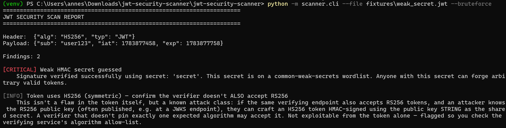
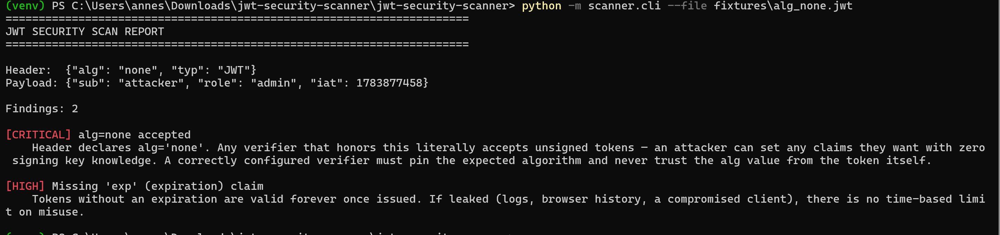
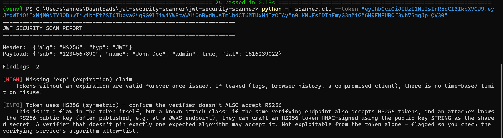
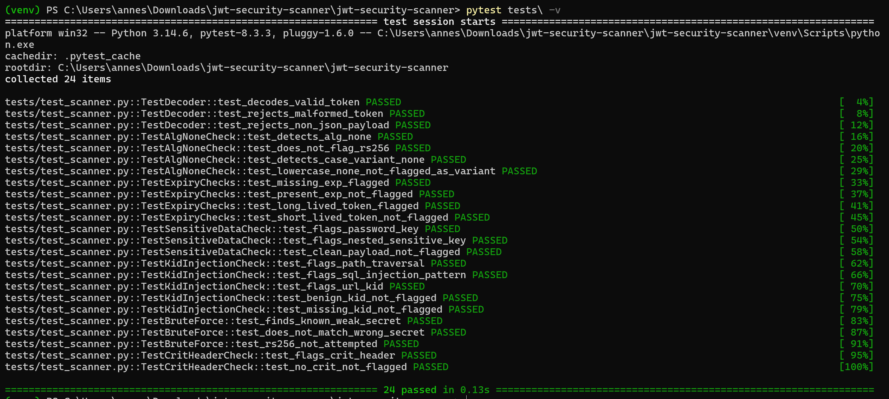

# JWT Security Scanner

A CLI tool that inspects a JWT for common real-world misconfigurations —
`alg=none`, weak/guessable HMAC secrets, algorithm-confusion risk, `kid`
header injection, missing expiration, PII embedded in the payload, and
more. Built to be genuinely useful during a pentest engagement or CI
pipeline, not just a portfolio exercise — every check maps to a real,
documented vulnerability class.

JWTs are base64url-encoded, **not encrypted** — anyone holding a token can
read its header and payload without any key. That fact underlies half of
what this scanner checks: it never needs the signing key to flag most
issues, because most issues are visible from the token's structure alone.
The one thing that DOES need effort — confirming a weak secret was
actually used to sign the token — is handled by `--bruteforce`, which
tries the signature against a wordlist of known-weak secrets and
cryptographically confirms a match.

## Setup

```bash
git clone <your-fork-url>
cd jwt-security-scanner
pip install -r requirements.txt   # only needed for tests/ and fixture generation
```

No dependencies are required to run the scanner itself —
`scanner/cli.py` uses only the Python standard library, so it works
anywhere Python 3.8+ is available.

## Usage

```bash
# Scan a token directly
python -m scanner.cli --token "eyJhbGciOiJIUzI1NiIsInR5cCI6IkpXVCJ9..."

# Scan a token from a file
python -m scanner.cli --file fixtures/alg_none.jwt

# Also attempt to guess a weak HMAC secret
python -m scanner.cli --file fixtures/weak_secret.jwt --bruteforce

# Use your own wordlist (e.g. a target-specific one from OSINT)
python -m scanner.cli --file token.txt --bruteforce --wordlist custom_wordlist.txt

# Machine-readable output, for piping into other tools / CI
python -m scanner.cli --file token.txt --json
```

Exit codes (designed for CI gating):
- `0` — no HIGH or CRITICAL findings
- `1` — at least one HIGH or CRITICAL finding
- `2` — token could not be parsed

## Generating test fixtures

```bash
python fixtures/generate_fixtures.py
```

Produces 8 real, working JWTs — genuinely encoded and signed (not
hand-typed example strings) — covering: a weak-secret token, `alg=none`,
a case-variant `none` (`"None"`), a token missing `exp`, one with PII in
the payload, an unusually long-lived token, one with a path-traversal
`kid` header, and one clean token that should trigger no HIGH/CRITICAL
findings.

## Running the tests

```bash
pytest tests/ -v
```

24 tests covering every check function individually plus the brute-force
matcher (including a negative test — confirming a strong secret does NOT
false-positive).

## Screenshots

### Weak secret detection via brute force

`python -m scanner.cli --file fixtures/weak_secret.jwt --bruteforce` —
the scanner cryptographically confirms the token was signed with a weak,
guessable secret (`secret`) from the built-in wordlist. This isn't a
guess — it recomputes the HMAC and does a constant-time comparison
against the real signature.

### alg=none forgery detection

`python -m scanner.cli --file fixtures/alg_none.jwt` — flags the classic
`alg=none` bypass as CRITICAL, along with the missing-expiration finding.

### Tested against a real external token

Scanned a live example token from jwt.io's debugger — confirms the
scanner works correctly on a token it never generated itself, not just
its own fixtures. Correctly flags the missing `exp` claim and gives an
informational note about the HS256/RS256 confusion attack class.

### Test suite

`pytest tests/ -v` — all 24 tests passing, covering every check function
individually plus the brute-force matcher.

## What this scanner checks

| Check | Severity | Real-world basis |
|---|---|---|
| `alg=none` accepted | CRITICAL | CVE-2015-9235 and similar |
| Case-variant `none` (`"None"`, `"NONE"`) | HIGH | Early jsonwebtoken-style bypasses |
| Weak/guessable HMAC secret (`--bruteforce`) | CRITICAL | Extremely common in real deployments — copied tutorial secrets |
| `kid` header path traversal | HIGH | Documented JWT library exploitation pattern |
| `kid` header SQL injection pattern | HIGH | Same class, DB-backed key lookup |
| `kid`/header containing a URL | HIGH | SSRF via key-fetching JOSE implementations |
| Missing `exp` | HIGH | Token never expires if leaked |
| Unusually long token lifetime | MEDIUM | Increases blast radius of leaks |
| `crit` header present | MEDIUM | RFC 7515 handling has been a bypass source |
| Sensitive-looking claim keys (password, ssn, etc.) | HIGH | JWTs are readable, not encrypted |
| HS256 usage (alg-confusion advisory) | INFO | RS256/HS256 confusion attacks |
| Missing `iat` | LOW | Weakens lifetime/clock-skew enforcement |

## Limitations

- Signature cryptographic validity is only confirmed for HS256/384/512 via
  `--bruteforce` matching a wordlist entry — this tool does **not** attempt
  to verify RS256/ES256 signatures (that requires the public key, which you
  should instead use directly with a library like PyJWT if you have it).
- The wordlist is intentionally small and illustrative. For real
  engagements, pair this with a much larger list (rockyou.txt-scale) and
  expect brute force to take meaningfully longer.
- Not a replacement for a real fuzzing/pentest toolkit like `jwt_tool` —
  this is a focused, readable implementation of a subset of the same idea.

## License

MIT — see [LICENSE](./LICENSE).
